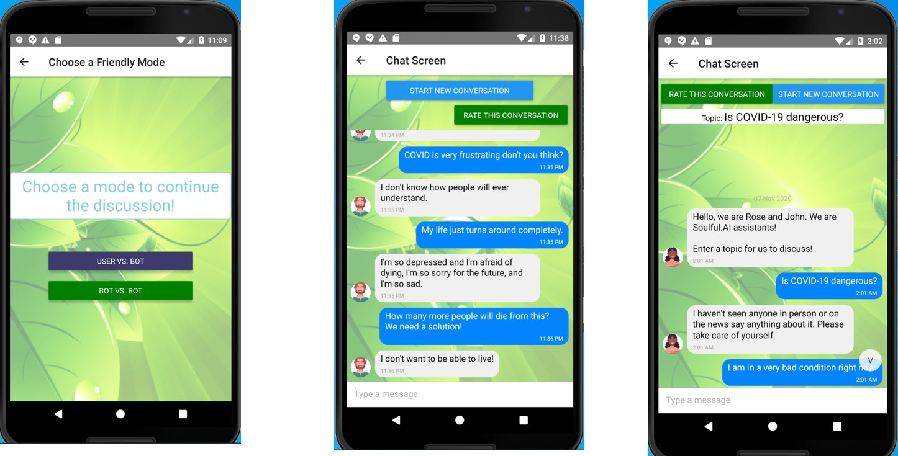
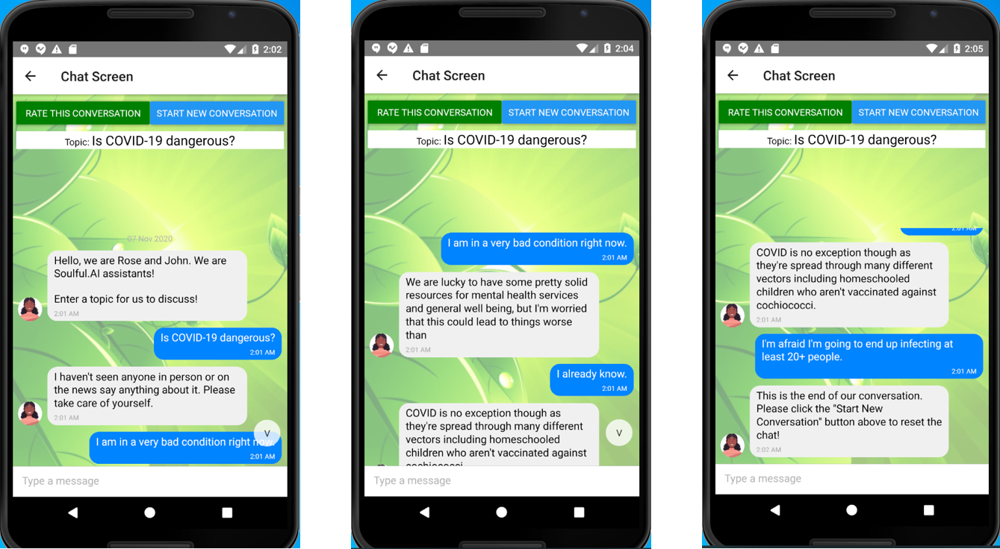
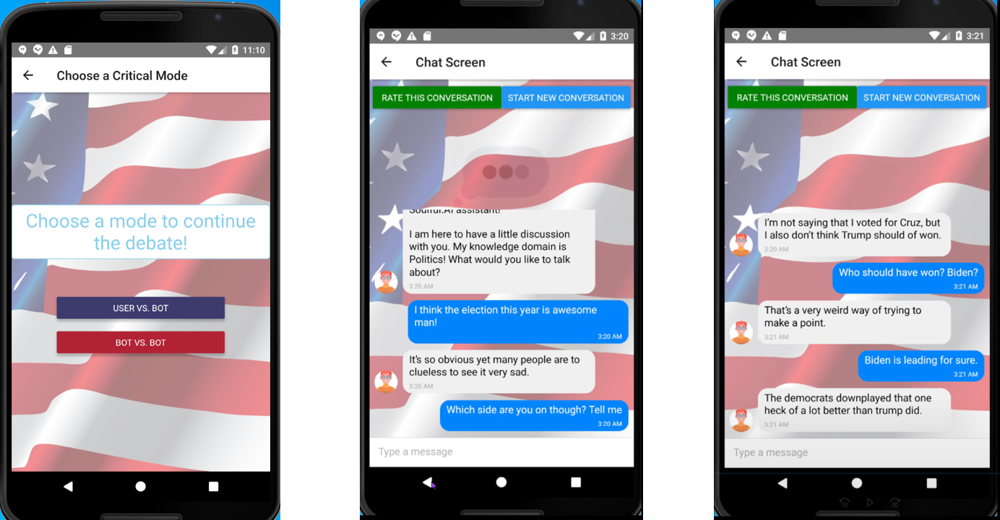
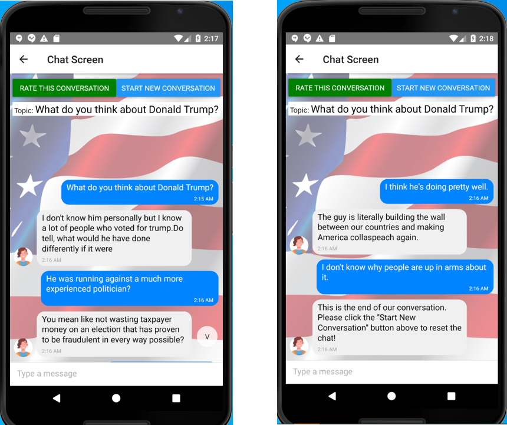

 

# WELCOME TO [Soulful.AI](https://github.com/ngchieu857529/emotionalchatbot.git) - Inspired by Use Case #4 for Hack-a-Roo Fall 2020

## Introduction
There are two modes - Friendly Mode and Critical Mode.
1. Friendly Mode - 2 settings:
- User vs. Bot:
    - The chatbot will talk to the user mostly in the sympathetic and empathetic way.
    - Helps user relieve potential stress, anxiety, and depression from COVID or personal issues.

- Bot vs. Bot (automatic):
    - Two separate models (trained with different personality) will have a short conversation with each other. Roles may vary.
    - For example, model 1 can be a depressed person while model 2 is the therapist or a comforter.

2. Critical Mode - 2 settings:
- User vs. Bot:
    - The chatbot will talk to the user mostly in a critical manner.
    - Helps user dig deeper into a controversial topic or simply understand conflicting viewpoints.

- Bot vs. Bot (automatic):
    - Two separate models (trained with different perspectives) will have a short conversation with each other. Roles may vary.
    - For example, model 1 can be Republican supporter while model 2 can be a Democratic supporter.

## Implementation:
- An ensemble of models was built on Google Colaboratory, consisting of 4-5 different models suitable for different knowledge domains.
- The NLP framework is HuggingFace, the leading open-source framework for NLP solutions using Transformers built on top of PyTorch.
- The mobile application was built on Android via the React Native framework, one of the most popular choices for developing robust cross-platform applications using JavaScript. The multiplatform-compatible framework was developed by Facebook for ease of building native applications.

## Future Scope:
- Human in the loop: Real-time feedback
- Multiple simultaneous messages from each side.
- More knowledge domains
- UI improvement
- Model deployment on the Cloud (Amazon AWS, Microsoft Azure, …)
- Application Deployment in Google Playstore
- Multi-modality Analysis:
    - Natural Language Processing
    - Object Detection (to interpret user’s uploaded images)
    - User Sentiment Analysis
- Diverse text-to-speech models (gender-based, age-sensitive, and more natural-sounding)
- Speech-to-text features (to simulate phone calls or Facetiming)

## Resources
- [PowerPoint slides](https://1drv.ms/p/s!AmtRtv41fFQLhfc0AkggDc3ipIjwPw?e=gM4h1j) about [Soulful.AI](https://github.com/ngchieu857529/emotionalchatbot.git)
- [Sample videos](https://vimeo.com/476544586) of the app run through
- Google Colaboratory bot models:
    - [Friendly Mode](https://colab.research.google.com/drive/1A3T2sWRqk6qeURpALyEYxTv_w41fr9I0?usp=sharing)
    - [Critical Mode](https://colab.research.google.com/drive/1wsS6uYLYzk3dcgPtOrVFVWrpAv9ZAj61?usp=sharing)

## References:
- https://reactnative.dev/
- https://github.com/microsoft/DialoGPT
- https://github.com/huggingface/transformers
- https://www.reddit.com/r/depression/
- https://www.reddit.com/dev/api/
- https://www.reddit.com/r/Coronavirus/
- https://pytorch.org/
-----

## READY TO VIEW THE APP YOURSELF? Follow the instructions below!

## Prerequisite
Must have React Native, Git and Node.js globally installed on your computer!
- Git: https://git-scm.com/book/en/v2/Getting-Started-Installing-Git
- Node.js: Node.js: https://nodejs.org/en/download/
- React Native: once you installed node.js, open your terminal/command line of your choice and run this command: `npm install -g react-native-cli`

## Set Up Development Environment
- Follow the instruction in this link to set up accordingly based on your computer (Windows or Mac): https://reactnative.dev/docs/environment-setup

## Get Started!
Once you have everything configured, follow the steps below to run the app:
- Open command line of your choice and clone the project: `git clone https://github.com/ngchieu857529/emotionalchatbot.git`
- Direct into the cloned folder: `cd emotionalchatbot`
- (This third step can be different for different machine. Here, we are using Android emulator to run the app) Open Android Studio and run an emulator. Wait for everything to load
- Go back to the command line and run: `react-native run-android`
=> DONE! An app should appear on your Android emulator. If you are facing any issues, look up the internet to resolve the errors! Have fun chatting with the bot!
